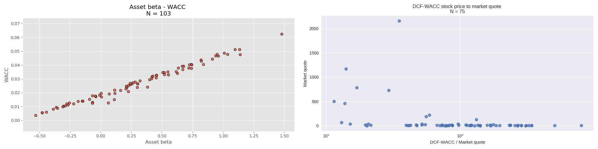
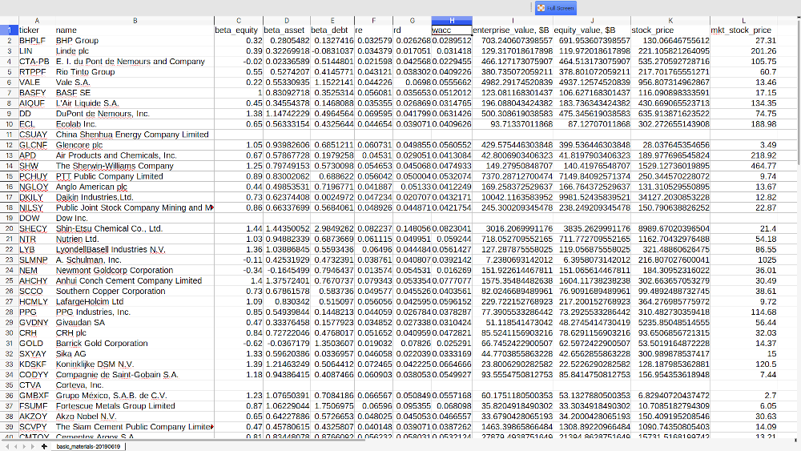

# Equity valuation kit

[](CHANGELOG.md)
[](CHANGELOG.md)
[](LICENSE.md)

>_"Price is what you pay. Value is what you get." - Warren Buffett_


## Description
Application performs equity valuation of NYSE-listed companies by extracting and analyzing data from public sources. DCF-WACC approach is the core of the valuation algorithm, which is based on pro-forma financial statement projections and the cost of capital analysis.



### Features
- coherent DCF-WACC equity valuation approach
- automated web data extraction from YahooFinance and other public sources
- cost of capital valuation: betas, required rate of return, WACC
- structuring and writing valuation results into csv report

Unsupervised execution of the valuation algorithm is primary objective of the program. Information is automatically extracted, processed and stored for further analysis.

### Algorithm
- extract web data: financial reports, risk-free rate, equity beta
- estimate cost of capital parameters: betas, cost of debt, equity, WACC
- get discount factors from WACC
- make CF projections in pro-forma financial statement
- calculate FCF, Terminal value
- compute Enterprise value, Equity value
- estimate implied stock price from Equity value/shares outstanding
- save valuation results to csv
- plot results

### Structure
- __evkit/__ - core modules of the program for web data extraction, analysis
- __reports/__ - directory, where all valuation reports and data are written
- __utils/__ - auxiliary bits and pieces to make everything work


## Clone, Compile, Run
The program is written in Python and is self-contained, thus does not require compiling. However, if you wish to tinker with standalone components, you can install it as a module to your Python environment as PyPi package.

### Install
Clone repository, navigate to the folder in Terminal. To get the most up-to-date version, clone master branch. Stable versions are labeled with tags.
```bash
git clone https://github.com/lialkaas/evkit.git
cd ~/evkit
```

_Optional_: install as PyPi package
```bash
pip install .
```

### Run
Run the program
```bash
python launcher.py
```

If you have Python 2 installed along with 3, or Python 3 is not initialized as default, run
```bash
python3 launcher.py
```

Once you launch the program, it will ask you to select the industry (sector), which contains the pool of listed stocks. Select by pressing ID of listed options. I select 'large_cap' pool by entering '1'.
```
ID | Industry
 0 | mega_cap
 1 | large_cap
 2 | basic_materials
 3 | healthcare
 4 | utilities
 5 | financial_services
 6 | consumer_defensive
 7 | consumer_cyclical
 8 | technology
 9 | energy
10 | real_estate
11 | communication_services
12 | industrials
Enter Industry ID: 1
```

The script will start collecting and analyzing all data required for equity valuation. Once execution completed or you terminated the program by pressing 'Ctrl+C', all data is written to appropriate csv report.
```
1/427 Processing ISG -> Missing trading information
2/427 Processing AZSEY
3/427 Processing NEE-PR
4/427 Processing MMM
...
24/427 Processing ASMLF
25/427 Processing SNPMF
26/427 Processing USB-PH^C
-> Program interrupted by user
-> Results saved to a file ./reports/large_cap-20190619.csv
```
Note, no data is lost due to premature termination of the process, ~~unless unknown critical error pops up~~. No matter how the program finishes, all collected data and valuation results will be saved to a file. The last line indicates the location of report, where you can access the data.

Here is how the result looks in Tables.



## License and Copyright
Copyright (c) 2019 Oleksii Lialka

Licensed under the [MIT License](LICENSE.md).
